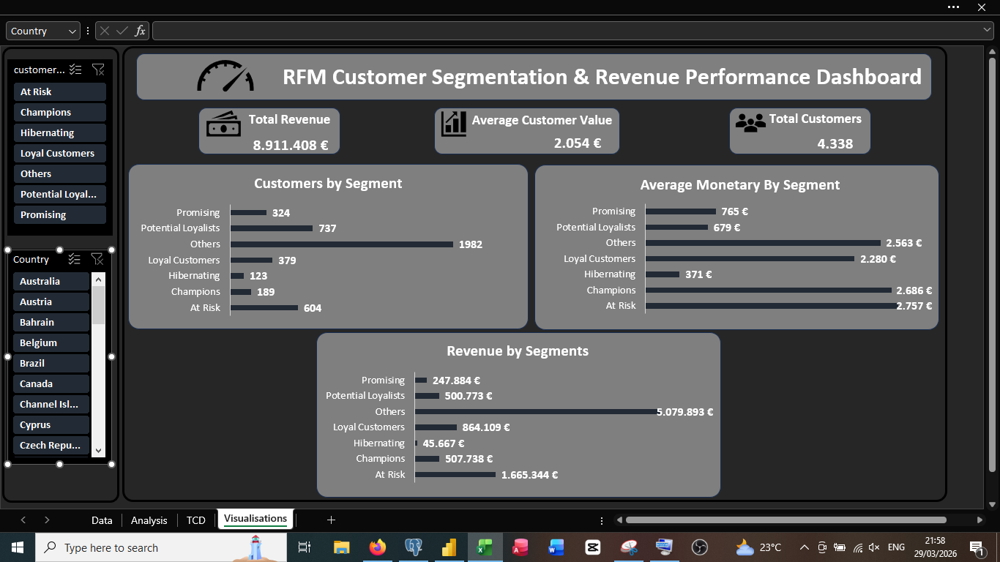
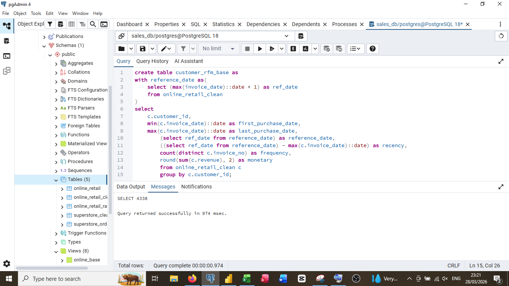
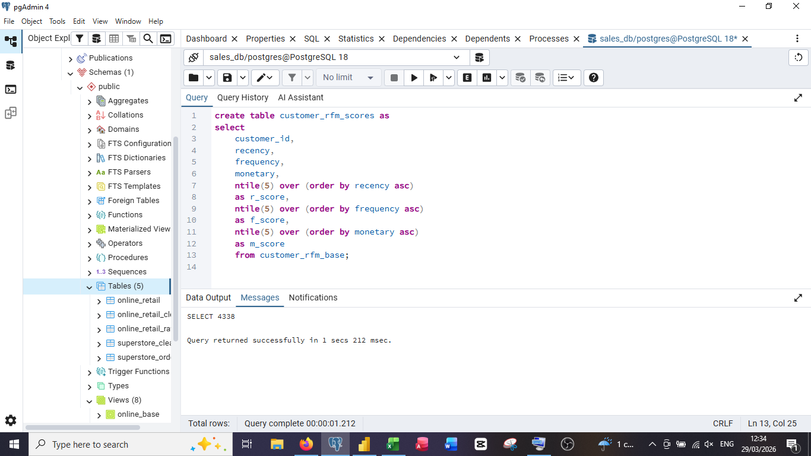
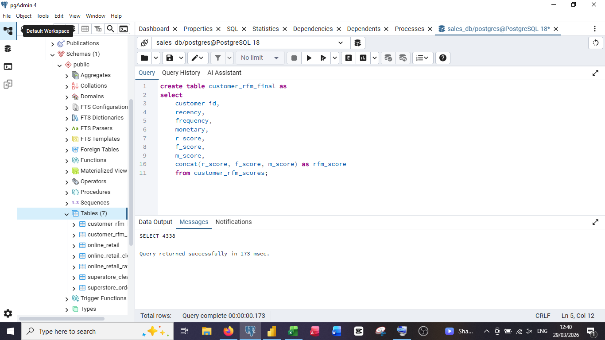

# 👥 Analyse du comportement client – Segmentation RFM

## 📌 Objectif

Segmenter les clients à partir de leur comportement d’achat afin d’identifier les profils les plus rentables, les clients fidèles, ceux à risque et les opportunités de réactivation.

---

## 🛠️ Outils utilisés

- Excel
- PostgreSQL
- Power BI

---

## 📖 Méthode utilisée

La segmentation repose sur la méthode **RFM** :

- **Récence** : date du dernier achat
- **Fréquence** : nombre d’achats effectués
- **Monétaire** : montant total dépensé

Chaque client reçoit un score sur ces trois dimensions, puis est classé dans un segment métier.

---

## 📊 Indicateurs clés

- Nombre total de clients
- Chiffre d’affaires total
- Valeur moyenne par client
- Répartition des clients par segment
- Chiffre d’affaires par segment

---

## 📷 Tableau de bord principal

  

---

## 📈 Insights clés

- Le segment **Others** représente le plus grand volume de clients et la plus forte contribution au chiffre d’affaires
- Les segments **Champions** et **Loyal Customers** regroupent les clients les plus stratégiques en termes de fidélité et de valeur
- Le segment **At Risk** génère encore un chiffre d’affaires important, ce qui montre un risque commercial réel en cas d’inaction
- Les segments **Promising** et **Potential Loyalists** représentent un fort potentiel de conversion vers des segments plus rentables
- Le segment **Hibernating** affiche une faible activité et une faible valeur, ce qui en fait une cible secondaire

---

## 🧮 Calcul des indicateurs RFM

  

Cette étape permet de calculer pour chaque client :
- la date du premier achat
- la date du dernier achat
- la récence
- la fréquence
- la valeur monétaire

---

## 🔢 Attribution des scores RFM

  

Les clients sont classés par score de récence, fréquence et valeur afin de créer une base de segmentation exploitable.

---

## 🧩 Construction du score final

  

Les trois scores sont combinés pour produire un score RFM global, utilisé ensuite pour attribuer chaque client à un segment métier.

---

## 📌 Recommandations

- Mettre en place des actions de fidélisation ciblées pour les segments **Champions** et **Loyal Customers**
- Lancer des campagnes de réactivation pour les clients **At Risk**
- Proposer des offres incitatives aux segments **Potential Loyalists** et **Promising**
- Réduire les efforts marketing sur les segments à très faible valeur, sauf en cas de stratégie spécifique
- Prioriser les décisions commerciales selon la contribution réelle de chaque segment au chiffre d’affaires

---

## 🎯 Conclusion

Ce projet montre comment la segmentation RFM permet de transformer des données transactionnelles en décisions marketing et commerciales concrètes.

Elle aide l’entreprise à mieux comprendre ses clients, à prioriser ses actions et à améliorer durablement la rentabilité commerciale.
